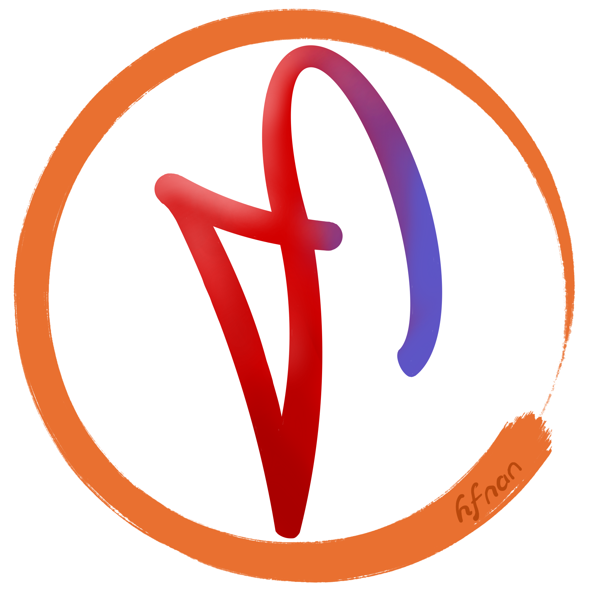

    

        
 
            
        

        
STR

    

    

> **轻量、高扩展** 的 `?`

+ 始于 `?` 年
+ 开源、长期维护
+ 无缝对接 `?`
+ 支持函数式、面向对象等高级特性(真的假的？)

[**Github仓库**](https://github.com/kula-lang/kula)
[*VSCode插件*](https://github.com/kula-lang/Kula-Diana)

